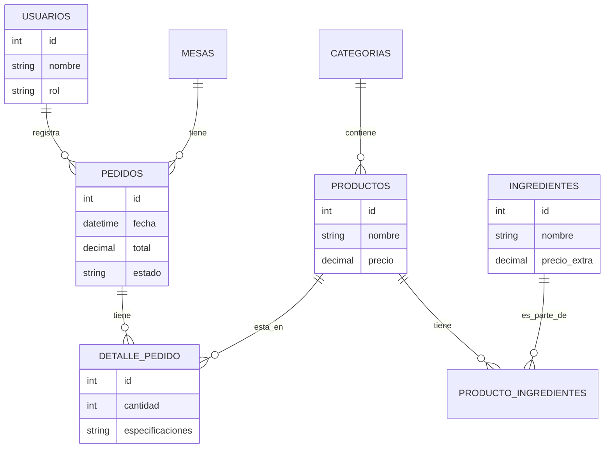
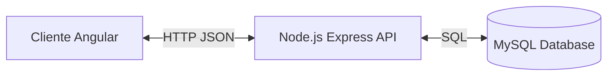

2025-11-18
## **1. Portada**

**Nombre del proyecto:** Restaurant POS System  
**Desarrollador:** Santiago Martínez   
**Fecha:** 30 de Noviembre de 2025  
**Versión del documento:** 1.0  

---
## **2. Control de versiones**

| **Versión** | **Fecha**  | **Autor**         | **Descripción del cambio**                         |
| ----------- | ---------- | ----------------- | -------------------------------------------------- |
| **1.0**     | 30/11/2025 | Santiago Martínez | Versión final del documento y entrega del proyecto |

---
## **3. Índice**

1. [Resumen ejecutivo](#4-resumen-ejecutivo)
2. [Introducción](#5-introducción)
3. [Requerimientos previos](#6-requerimientos-previos)
4. [Análisis y diseño](#7-análisis-y-diseño)
5. [Desarrollo e implementación](#8-desarrollo-e-implementación)
6. [Pruebas](#9-pruebas)
7. [Resultados y conclusiones](#10-resultados-y-conclusiones)
8. [Manual de usuario](#11-manual-de-usuario-opcional)
9. [Manual técnico](#12-manual-técnico-opcional-pero-muy-útil)
10. [Anexos](#13-anexos)
11. [Referencias](#14-referencias)
  
---
## **4. Resumen ejecutivo**

**Restaurant POS System** es un sistema integral de Punto de Venta (POS) y Gestión de Restaurantes diseñado para optimizar el flujo de trabajo en establecimientos gastronómicos de alta gama.

- **Propósito general:** Digitalizar y agilizar el proceso de toma de pedidos, comunicación con cocina y administración de ventas.
- **Público objetivo:** Restaurantes que requieren un control preciso de ingredientes y una experiencia de usuario moderna.
- **Funcionalidades principales:**
    - Toma de pedidos con personalización detallada de ingredientes (quitar/agregar).
    - Sistema de visualización en cocina (KDS) en tiempo real.
    - Panel administrativo con reportes de ventas.
    - Landing page atractiva para la presencia de marca.
- **Beneficios esperados:** Reducción de errores en comandas, mejora en tiempos de preparación y control exacto de ingresos.
- **Tecnologías utilizadas:** Angular 18+, Node.js, Express, MySQL, Bootstrap 5.

---
## **5. Introducción**

**Contexto:**
La gestión tradicional de restaurantes mediante comandas de papel es propensa a errores y retrasos. **Restaurant POS System** surge como una solución tecnológica para modernizar este proceso, enfocándose en la experiencia de usuario (UX) mediante un diseño "Glassmorphism" y una arquitectura robusta.

**Objetivos:**
- **General:** Desarrollar un sistema Full Stack funcional para la gestión operativa de un restaurante.
- **Específicos:**
    - Implementar una interfaz dinámica en Angular para la selección de productos.
    - Crear una API REST en Node.js para la persistencia de datos.
    - Gestionar relaciones complejas de base de datos (Productos-Ingredientes).

**Alcance:**
El sistema incluye la gestión de pedidos (Mesero), visualización (Cocina) y administración (Gerente). No incluye facturación electrónica ni gestión de inventarios avanzada en esta versión.

---
## **6. Requerimientos previos**

#### 6.1 Requisitos funcionales
1. **RF1 - Gestión de Pedidos:** El sistema permitirá seleccionar mesa, mesero y productos del menú.
2. **RF2 - Personalización:** El usuario podrá modificar los ingredientes de un platillo (ej. "Sin Cebolla", "Extra Queso") y el precio se actualizará automáticamente.
3. **RF3 - Comunicación a Cocina:** Los pedidos confirmados aparecerán inmediatamente en la pantalla KDS.
4. **RF4 - Administración:** El administrador podrá visualizar el total de ventas y pedidos del día.
5. **RF5 - Catálogo:** Visualización de productos filtrados por categorías (Hamburguesas, Bebidas, etc.).

#### 6.2 Requisitos no funcionales
1. **RNF1 - Usabilidad:** La interfaz debe ser intuitiva y táctil (diseño responsive con Bootstrap).
2. **RNF2 - Estética:** El diseño debe seguir el estilo Glassmorphism con la paleta de colores definida (Terracota, Oro, Gris).
3. **RNF3 - Rendimiento:** Las consultas a la base de datos deben ejecutarse en menos de 1 segundo.

#### 6.3 Requisitos técnicos / de entorno
- **Frontend:** Angular 18 (Standalone Components), Bootstrap 5, FontAwesome.
- **Backend:** Node.js, Express.js.
- **Base de Datos:** MySQL 8.0.
- **Entorno:** Windows 10/11.

---
## **7. Análisis y diseño**
#### 7.1 Modelado del sistema

**Diagrama de Flujo de Pedido (Simplificado):**
1. Mesero selecciona Mesa.
2. Mesero agrega Productos al carrito.
3. Mesero personaliza ingredientes (Modal).
4. Mesero confirma pedido -> API POST -> DB.
5. KDS consulta pedidos pendientes -> Cocina prepara -> Cocina marca como "Completado".

#### 7.2 Modelo de datos

**Diagrama Entidad-Relación (Mermaid):**
  


#### 7.3 Arquitectura del sistema  

El sistema sigue una arquitectura **Cliente-Servidor** con patrón **MVC** en el backend y arquitectura de componentes en el frontend.




---

## **8. Desarrollo e implementación**

#### 8.1 Estructura del proyecto
- **Frontend (`/frontend`):**
    - `src/app/components`: Contiene los componentes visuales (pages y shared).
    - `src/app/services`: `ApiService` para comunicación HTTP.
    - `src/app/interfaces`: Modelos TypeScript (`Product`, `Order`).
- **Backend (`/backend`):**
    - `src/controllers`: Lógica de negocio (`product.controller.js`, `order.controller.js`).
    - `src/routes`: Definición de endpoints.
    - `src/database`: Configuración de conexión (`db.js`).

#### 8.2 Descripción de módulos
1. **Módulo de Ventas (POS):** Componentes `MenuSelection`, `ProductCard`, `TicketSummary`. Maneja la lógica del carrito de compras.
2. **Módulo de Cocina (KDS):** Componente `KitchenDisplay`. Realiza polling para obtener pedidos nuevos.
3. **Módulo de Administración:** Componente `AdminDashboard`. Muestra tablas y métricas.
4. **Módulo de Personalización:** Componente `IngredientModal`. Gestiona la lógica de ingredientes default vs. extras.

#### 8.3 Integraciones externas
- **API REST Propia:** El frontend consume la API desarrollada en el backend (`http://localhost:3000/api`).

#### 8.4 Configuración del entorno de desarrollo
1. **Base de Datos:** Ejecutar script `db_schema.sql` en MySQL Workbench.
2. **Backend:**

   ```bash
   cd backend
   npm install
   node src/index.js
   ```

3. **Frontend:**

   ```bash
   cd frontend
   npm install
   ng serve
   ```

---

## **9. Pruebas**
#### 9.1 Estrategia de pruebas
Se realizaron **pruebas manuales de sistema** y **pruebas de integración** verificando el flujo completo de datos desde la UI hasta la base de datos.
  
#### 9.2 Casos de prueba

| **ID**   | **Módulo** | **Entrada**                | **Proceso**                | **Resultado esperado**           | **Resultado obtenido**           | **Estado** |
| -------- | ---------- | -------------------------- | -------------------------- | -------------------------------- | -------------------------------- | ---------- |
| **CP01** | POS        | Selección de "Sin Cebolla" | Agregar al carrito         | Ticket muestra "Sin Cebolla"     | Ticket muestra "Sin Cebolla"     | Aprobado   |
| **CP02** | POS        | Agregar ingrediente extra  | Seleccionar "Tocino Extra" | Precio aumenta +$25.00           | Precio aumenta +$25.00           | Aprobado   |
| **CP03** | KDS        | Nuevo pedido creado        | Esperar actualización      | Aparece en pantalla de cocina    | Aparece en pantalla              | Aprobado   |
| **CP04** | Admin      | Carga de dashboard         | Abrir página admin         | Mostrar total de ventas correcto | Mostrar total de ventas correcto | Aprobado   |


---
## **10. Resultados y conclusiones**
- **Logros:** Se logró implementar un sistema estable con una interfaz moderna y atractiva. La personalización de ingredientes funciona correctamente, calculando precios dinámicos.
- **Problemas y Soluciones:**
    - *Problema:* CORS errors al conectar frontend y backend.
    - *Solución:* Configuración del middleware `cors` en Express.
    - *Problema:* Visualización de imágenes externas.
    - *Solución:* Uso de URLs de Unsplash y manejo de errores de carga en ``.
- **Conclusión:** El proyecto cumple con todos los requerimientos académicos y funcionales, entregando un producto base sólido para un restaurante real.

---
## **11. Manual de usuario (opcional)**

1. **Ingresar al sistema:** Navegar a la Landing Page y hacer clic en "Ordenar Ahora".
2. **Iniciar Pedido:** Seleccionar su nombre de mesero y la mesa a atender.
3. **Seleccionar Productos:** Navegar por las categorías y hacer clic en los productos.
4. **Personalizar:** Si el producto lo permite, usar el modal para quitar/poner ingredientes.
5. **Confirmar:** Revisar el ticket a la derecha y dar clic en "Confirmar Pedido".
6. **Cocina:** El personal de cocina verá el pedido y podrá marcarlo como listo.

---  
## **12. Manual técnico**

**Endpoints Principales:**
- `GET /api/products`: Obtener catálogo.
- `GET /api/products/:id/ingredients`: Obtener ingredientes de un producto.
- `POST /api/orders`: Crear nuevo pedido.
- `GET /api/orders/active`: Obtener pedidos para cocina.

**Configuración DB:**
Archivo: `backend/src/db.js`
Variables: `DB_HOST`, `DB_USER`, `DB_PASSWORD`, `DB_NAME`.

---  
## **13. Anexos**

- **Repositorio:** [Enlace al repositorio de GitHub]
- **Script SQL:** Incluido en `backend/database/db_schema.sql`.

---
## **14. Referencias**

- Documentación oficial de Angular: https://angular.io/docs
- Documentación de Express.js: https://expressjs.com/
- Bootstrap 5 Docs: https://getbootstrap.com/docs/5.0/getting-started/introduction/